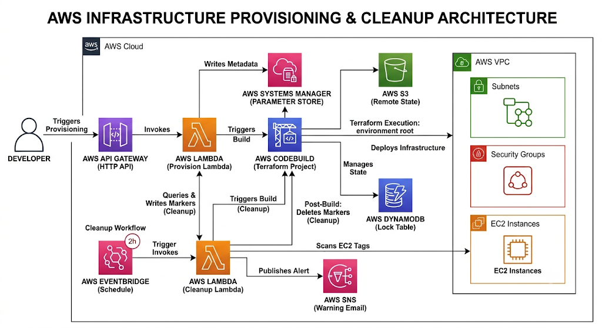

# AWS Sandbox Provisioning Platform

Self-service, API-driven AWS sandbox environments with automatic TTL-based cleanup, built on Lambda, CodeBuild, and Terraform.

---

## Overview

Provisioning a throwaway AWS environment for testing or debugging usually means one of two things: filing a ticket and waiting on a platform team, or handing developers standing AWS access and hoping they remember to clean up after themselves. Neither scales well: the first creates a bottleneck, the second creates cost leakage and security drift.

This project removes both problems. A developer calls a single API endpoint with an environment name and a time-to-live (TTL). Everything after that (provisioning, tagging, expiry tracking, warning notifications, and teardown) is fully automated. No AWS console access, no manual Terraform commands, and no environment left running past its TTL.

---

## Architecture



**Two independent Terraform layers:**

| Layer | Root | State key | Deployed by |
|---|---|---|---|
| **Platform:** API Gateway, both Lambdas, CodeBuild project, EventBridge rule, SNS topic, IAM roles | `terraform/infrastructure` | `infra/main/terraform.tfstate` | Deployed once, manually, by the operator |
| **Sandbox environment:** VPC, subnet, security group, EC2 instance | `terraform/environment` | `envs/<environment-name>/terraform.tfstate` | Deployed automatically, per request, by CodeBuild |

Each sandbox gets its own isolated state file, so provisioning or destroying one environment can never touch another environment, or the platform itself.

---

## How It Works

1. **Provision:** A developer sends `POST /environments` with an environment name and TTL. API Gateway invokes the **Provision Lambda**, which validates the request, records metadata in SSM Parameter Store, and starts a **CodeBuild** run against the `terraform/environment` Terraform root using a state key scoped to that environment name.
2. **Tag:** Every resource created is tagged with `owner`, `created-at`, `ttl-hours`, `allowed-ssh-cidr`, `provisioner/project`, and `provisioner/environment` (the source of truth the cleanup process reads back later.
3. **Monitor:** An **EventBridge** rule invokes the **Cleanup Lambda** every 2 hours. It scans live EC2 instances by tag, computes each environment's expiry time from its tags, and sends a one-time SNS warning email 30 minutes before expiry.
4. **Destroy:** Once an environment's TTL has elapsed, the Cleanup Lambda starts a CodeBuild `destroy` run scoped to that environment's own state file. On success, its warning and teardown markers in SSM are cleaned up.

No developer ever runs `terraform apply` or `terraform destroy` themselves for a sandbox; CodeBuild does, triggered entirely by the Lambdas.

---

## Repository Layout

```text
buildspec.yml                      # CodeBuild provision/destroy commands

lambda/
  provision/handler.py             # API Gateway Lambda: validates & starts provisioning
  cleanup/handler.py               # Scheduled Lambda: TTL scan, warnings, teardown

terraform/
  backend/                         # One-time S3 + DynamoDB state backend bootstrap
  infrastructure/                  # Platform: API Gateway, Lambdas, CodeBuild, SNS, EventBridge, IAM
  environment/                     # Terraform root executed by CodeBuild per sandbox
  modules/environment/             # Reusable VPC / subnet / EC2 / security group module
```

---

## Prerequisites

- AWS account (free tier eligible)
- Terraform `>= 1.6`
- AWS CLI, configured locally for initial bootstrap
- This repository hosted on GitHub, CodeCommit, or another CodeBuild-supported source
- CodeBuild source access configured if the repository is private

All runtime IAM roles are created by Terraform itself; no `AdministratorAccess` is required for CodeBuild or either Lambda at runtime.

---

## Setup

### 1. Bootstrap Terraform state

Creates the S3 bucket and DynamoDB table used for remote state across the rest of the project.

```bash
cd terraform/backend

terraform init

terraform apply \
  -var="aws_region=ap-south-1" \
  -var="state_bucket_name=<globally-unique-state-bucket>" \
  -var="lock_table_name=aws-env-provisioner-tf-locks"
```

Save the output values: you'll need them in the next step.

### 2. Deploy the platform

Creates the API Gateway, both Lambdas, the CodeBuild project, EventBridge schedule, SNS topic, and runtime IAM roles.

```bash
cd terraform/infrastructure

terraform init \
  -backend-config="bucket=<STATE_BUCKET>" \
  -backend-config="key=infra/main/terraform.tfstate" \
  -backend-config="region=ap-south-1" \
  -backend-config="dynamodb_table=<LOCK_TABLE>" \
  -backend-config="encrypt=true"

terraform apply \
  -var="aws_region=ap-south-1" \
  -var="state_bucket_name=<STATE_BUCKET>" \
  -var="lock_table_name=<LOCK_TABLE>" \
  -var="repository_url=https://github.com/<OWNER>/aws-env-provisioner.git" \
  -var="source_version=main" \
  -var="sns_email=you@example.com"
```

Confirm the SNS email subscription (AWS will not deliver warning emails until confirmed).

Retrieve the API endpoint:

```bash
terraform output provision_url
```

> **Note:** Steps 1 and 2 deploy the *platform*, and are a one-time, manual operation. They are never repeated per sandbox environment.

---

## API Reference

### `POST /environments`

**Request body:**

```json
{
  "environment_name": "<OWNER>-test",
  "ttl_hours": 2,
  "owner": "<OWNER>",
  "allowed_ssh_cidr": "203.0.113.10/32"
}
```

| Field | Required | Description |
|---|---|---|
| `environment_name` | Yes | 3–40 characters, alphanumeric or hyphen, no leading/trailing hyphen |
| `ttl_hours` | Yes | One of `2`, `4`, `8`, `24` |
| `owner` | No | Stored in tags. Defaults to the caller's source IP if omitted |
| `allowed_ssh_cidr` | No | Security group SSH CIDR. Defaults to `default_allowed_ssh_cidr` |

**Response (`200`):**

```json
{
  "message": "Provision build started",
  "environment_name": "<OWNER>-test",
  "build_id": "aws-env-provisioner-terraform:...",
  "build_arn": "arn:aws:codebuild:...",
  "created_at": "2026-05-18T10:15:00Z"
}
```

---

## Runtime IAM Roles

| Role | Purpose |
|---|---|
| `aws-env-provisioner-terraform-role` | CodeBuild service role that runs Terraform provision/destroy |
| `aws-env-provisioner-provision-api-role` | Provision Lambda role: writes SSM metadata, starts provision builds |
| `aws-env-provisioner-cleanup-role` | Cleanup Lambda role: scans tags, sends SNS warnings, starts destroy builds |

Each role is scoped to only what its function needs; no role has broad EC2, IAM, or account-wide permissions.

---

## Verification

**Provision an environment:**

```bash
curl -X POST "<PROVISION_URL>" \
  -H "content-type: application/json" \
  -d '{"environment_name":"<OWNER>-test","ttl_hours":2,"owner":"<OWNER>","allowed_ssh_cidr":"203.0.113.10/32"}'
```

**Watch the CodeBuild run:**

```bash
aws codebuild list-builds-for-project \
  --project-name aws-env-provisioner-terraform
```

**Check live environments:**

```bash
aws ec2 describe-instances \
  --filters "Name=tag:provisioner/project,Values=aws-env-provisioner" \
  --query "Reservations[].Instances[].{Id:InstanceId,State:State.Name,Env:Tags[?Key=='provisioner/environment']|[0].Value}" \
  --output table
```

**Check SSM metadata:**

```bash
aws ssm get-parameter \
  --name "/<PROJECT_NAMESPACE>/aws-env-provisioner/environments/<OWNER>-test" \
  --query "Parameter.Value" \
  --output text
```

**Trigger cleanup manually:**

```bash
aws lambda invoke \
  --function-name aws-env-provisioner-cleanup \
  --payload '{}' \
  response.json

cat response.json
```

---

## Cost Profile

This project is designed to stay inside AWS free tier for light usage:

- EC2 `t2.micro`
- One VPC and one public subnet per environment
- CodeBuild `BUILD_GENERAL1_SMALL`
- Lambda, 128 MB
- EventBridge, scheduled every 2 hours
- S3 and DynamoDB with minimal state/lock usage
- SNS email notifications
- SSM standard parameters

Actual free-tier eligibility depends on account age, region, and existing usage (check AWS Billing after testing.

---

## Troubleshooting

Issues encountered while building and running this project, and how to resolve them.

**Terraform apply fails during resource reconciliation**
Terraform needs several EC2 *read* permissions in addition to create/delete permissions, or applies can fail partway through:
```json
"ec2:DescribeVpcAttribute",
"ec2:DescribeInstanceTypes",
"ec2:DescribeInstanceAttribute"
```

**`AccessDeniedException: No access to reserved parameter name`**
AWS reserves the `/aws/*` SSM namespace. Use a project-scoped namespace instead, e.g. `/<PROJECT_NAMESPACE>/aws-env-provisioner/environments/*` (example: `/<OWNER>/aws-env-provisioner/environments/<OWNER>-test`).

**SSM parameter tagging fails after otherwise successful provisioning**
The CodeBuild role needs:
```json
"ssm:AddTagsToResource",
"ssm:ListTagsForResource",
"ssm:RemoveTagsFromResource"
```

**API Gateway, CodeBuild, or EventBridge lookups fail unexpectedly**
Usually a region mismatch. The backend region, provider region, and `-var="aws_region=..."` must all match exactly.

**`ResourceAlreadyExistsException` on redeploy**
Happens when Terraform state becomes inconsistent or partially destroyed (affects Lambda functions, CodeBuild projects, CloudWatch log groups, IAM roles). Fix by importing the orphaned resource into state, deleting it manually, or rebuilding the backend cleanly.

**`BucketNotEmpty` when deleting the backend bucket**
S3 backend buckets with versioning enabled can't be deleted while object versions remain. Empty the bucket's objects, remove all object versions, then delete the bucket.

**Recommended deploy/destroy order**

| | Order |
|---|---|
| **Deploy** | `terraform/backend` → `terraform/infrastructure` |
| **Destroy** | `terraform/infrastructure` → `terraform/backend` |

Destroying the backend first can strand Terraform state and orphan infrastructure resources.

**Debugging IAM permission gaps**
It can help to temporarily broaden IAM during initial development to isolate exactly which runtime actions Terraform needs:
```json
"ec2:*",
"ssm:*"
```
Tighten back down to the minimum required action set once confirmed. This should never ship as the final permission set.

---

## Known Limitations / Roadmap

This is a working prototype, not a production-hardened platform. Known gaps, in rough priority order:

- No authorizer (IAM or JWT) on the API Gateway endpoint, meaning anyone with the URL can provision environments
- SSH access is CIDR-restricted but still public; SSM Session Manager would remove the need for open inbound SSH entirely
- No API keys or usage plans / rate limiting
- No manual endpoint to extend an environment's TTL or force an early destroy
- No cost guardrails (e.g., AWS Budgets integration)
- Notification routing is a single SNS topic rather than per-owner email routing
- IAM policies are scoped but not yet fully least-privilege audited

---

## License

This project is licensed under the [MIT License](LICENSE).
