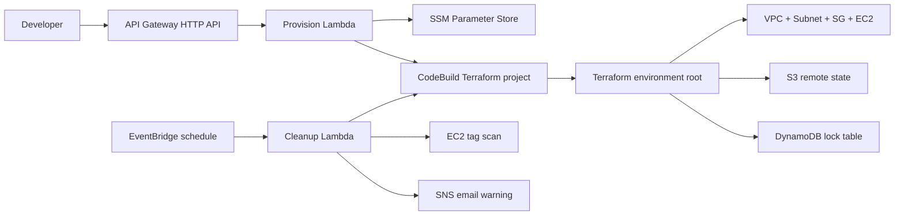

# aws-env-provisioner

API-driven, self-service AWS environment provisioning with automatic TTL cleanup.

Developers call an API Gateway endpoint with an environment name and TTL. API Gateway invokes a Python 3.12 Lambda that validates the request, stores request metadata in SSM Parameter Store, and starts an AWS CodeBuild project. CodeBuild runs Terraform to provision an isolated environment:

- VPC
- Public subnet
- Internet gateway and route table
- EC2 `t2.micro`
- Security group
- SSM environment metadata
- S3 remote Terraform state
- DynamoDB state locking

Every provisioned environment is tagged with:

- `owner`
- `created-at`
- `ttl-hours`
- `allowed-ssh-cidr`
- `provisioner/project`
- `provisioner/environment`

A separate EventBridge-scheduled cleanup Lambda runs every 2 hours. It scans live EC2 instances by tag, sends an SNS email 30 minutes before teardown when the scan catches the warning window, and starts a CodeBuild `destroy` run for expired environments.

---

# Architecture



---

# Repository Layout

```text
buildspec.yml                     # CodeBuild provision/destroy commands

lambda/
  provision/handler.py             # API Gateway Lambda
  cleanup/handler.py               # scheduled TTL cleanup Lambda

terraform/
  backend/                         # one-time S3 + DynamoDB bootstrap
  infrastructure/                  # API Gateway, Lambdas, CodeBuild, SNS, EventBridge, IAM
  environment/                     # Terraform root executed by CodeBuild
  modules/environment/             # VPC/subnet/EC2/security group module
```

---

# Request API

Endpoint:

```http
POST /environments
```

Example:

```bash
curl -X POST "<PROVISION_URL>" \
  -H "content-type: application/json" \
  -d '{
    "environment_name": "jaith-test",
    "ttl_hours": 2,
    "owner": "jaith",
    "allowed_ssh_cidr": "203.0.113.10/32"
  }'
```

Required fields:

| Field              | Description                                                    |
| ------------------ | -------------------------------------------------------------- |
| `environment_name` | 3-40 chars, alphanumeric or hyphen, no leading/trailing hyphen |
| `ttl_hours`        | One of `2`, `4`, `8`, `24`                                     |

Optional fields:

| Field              | Description                                                      |
| ------------------ | ---------------------------------------------------------------- |
| `owner`            | Stored in tags. If omitted, Lambda uses the caller source IP.    |
| `allowed_ssh_cidr` | Security group SSH CIDR. Defaults to `default_allowed_ssh_cidr`. |

Successful response:

```json
{
  "message": "Provision build started",
  "environment_name": "jaith-test",
  "build_id": "aws-env-provisioner-terraform:...",
  "build_arn": "arn:aws:codebuild:...",
  "created_at": "2026-05-18T10:15:00Z"
}
```

---

# Prerequisites

* AWS account with free tier eligibility.
* Terraform `>= 1.6`.
* AWS CLI configured locally for initial bootstrap.
* This repository pushed to GitHub, CodeCommit, or another CodeBuild-supported source.
* CodeBuild source access configured for your repo if it is private.

The Terraform in `terraform/infrastructure` creates the runtime IAM roles. You do not need `AdministratorAccess` for CodeBuild or either Lambda at runtime.

---

# 1. Bootstrap Terraform State

The backend stack creates:

* S3 bucket for remote state.
* DynamoDB table for state locks.

Pick a globally unique S3 bucket name:

```bash
cd terraform/backend

terraform init

terraform apply \
  -var="aws_region=ap-south-1" \
  -var="state_bucket_name=<globally-unique-state-bucket>" \
  -var="lock_table_name=aws-env-provisioner-tf-locks"
```

Save the output values.

---

# 2. Deploy Main Infrastructure

This creates:

* API Gateway HTTP API.
* Provision Lambda.
* Cleanup Lambda.
* EventBridge schedule.
* SNS warning topic and optional email subscription.
* CodeBuild Terraform project.
* Runtime IAM roles and least-privilege inline policies.

```bash
cd terraform/infrastructure

terraform init \
  -backend-config="bucket=<STATE_BUCKET>" \
  -backend-config="key=infra/main/terraform.tfstate" \
  -backend-config="region=ap-south-1" \
  -backend-config="dynamodb_table=<LOCK_TABLE>" \
  -backend-config="encrypt=true"

terraform apply \
  -var="aws_region=ap-south-1" \
  -var="state_bucket_name=<STATE_BUCKET>" \
  -var="lock_table_name=<LOCK_TABLE>" \
  -var="repository_url=https://github.com/<OWNER>/aws-env-provisioner.git" \
  -var="source_version=main" \
  -var="sns_email=you@example.com"
```

Confirm the SNS email subscription. AWS will not deliver email notifications until you confirm it.

Get the API URL:

```bash
terraform output provision_url
```

---

# Runtime IAM Roles

Terraform creates these roles:

| Role                                     | Purpose                                                                             |
| ---------------------------------------- | ----------------------------------------------------------------------------------- |
| `aws-env-provisioner-terraform-role`     | CodeBuild service role that runs Terraform provision/destroy.                       |
| `aws-env-provisioner-provision-api-role` | Provision Lambda role that writes SSM metadata and starts provision builds.         |
| `aws-env-provisioner-cleanup-role`       | Cleanup Lambda role that scans tags, sends SNS warnings, and starts destroy builds. |

---

# Provision Flow Details

`lambda/provision/handler.py`

1. Accepts JSON body or query parameters.

2. Validates:

   * environment name format
   * TTL is one of `2`, `4`, `8`, `24`
   * SSH CIDR is valid

3. Stores request metadata in:

```text
/<PROJECT_NAMESPACE>/aws-env-provisioner/environments/<environment-name>
```

4. Starts CodeBuild with environment overrides:

```text
ACTION=provision
ENVIRONMENT_NAME=<name>
TTL_HOURS=<2|4|8|24>
OWNER=<owner>
CREATED_AT=<UTC timestamp>
ALLOWED_SSH_CIDR=<cidr>
```

`buildspec.yml` initializes the backend key:

```text
envs/<environment-name>/terraform.tfstate
```

and runs:

```bash
terraform apply -auto-approve
```

---

# Destroy Flow Details

`lambda/cleanup/handler.py`

1. Runs every 2 hours through EventBridge.
2. Scans EC2 instances with:

```text
provisioner/project=aws-env-provisioner
```

3. Reads `created-at` and `ttl-hours`.
4. Sends one SNS warning per environment when inside the warning window.
5. Starts CodeBuild with:

```text
ACTION=destroy
ENVIRONMENT_NAME=<name>
TTL_HOURS=<original ttl>
OWNER=<original owner>
CREATED_AT=<original timestamp>
ALLOWED_SSH_CIDR=<original cidr>
```

6. `buildspec.yml` runs:

```bash
terraform destroy -auto-approve
```

7. On successful destroy, CodeBuild deletes warning and teardown marker parameters.

---

# Verification

Provision:

```bash
curl -X POST "<PROVISION_URL>" \
  -H "content-type: application/json" \
  -d '{"environment_name":"jaith-test","ttl_hours":2,"owner":"jaith","allowed_ssh_cidr":"203.0.113.10/32"}'
```

Watch CodeBuild:

```bash
aws codebuild list-builds-for-project \
  --project-name aws-env-provisioner-terraform
```

Check live environments:

```bash
aws ec2 describe-instances \
  --filters "Name=tag:provisioner/project,Values=aws-env-provisioner" \
  --query "Reservations[].Instances[].{Id:InstanceId,State:State.Name,Env:Tags[?Key=='provisioner/environment']|[0].Value}" \
  --output table
```

Check SSM metadata:

```bash
aws ssm get-parameter \
  --name "/<PROJECT_NAMESPACE>/aws-env-provisioner/environments/jaith-test" \
  --query "Parameter.Value" \
  --output text
```

Invoke cleanup manually:

```bash
aws lambda invoke \
  --function-name aws-env-provisioner-cleanup \
  --payload '{}' \
  response.json

cat response.json
```

---

# Free Tier Notes

This project is intentionally small:

* EC2 `t2.micro`
* One VPC and one public subnet per environment
* CodeBuild `BUILD_GENERAL1_SMALL`
* Lambda 128 MB
* EventBridge scheduled every 2 hours
* S3 and DynamoDB with tiny state/lock usage
* SNS email
* SSM standard parameters

Free tier depends on account age, region, and existing usage. Check AWS Billing after testing.

---

# What Can Be Added Next

* IAM authorization or JWT authorizer on API Gateway
* API keys and usage plans
* SSM Session Manager access instead of public SSH
* Per-owner email routing through SSM
* Slack or Teams teardown notifications
* A manual extension endpoint that updates `ttl-hours`
* A manual destroy API endpoint
* Cost guardrails with AWS Budgets
* Full least-privilege IAM hardening

---

# Common Deployment Pitfalls and Required IAM Permissions

This project relies heavily on runtime Terraform execution through CodeBuild. Missing IAM permissions are the most common deployment issue.

## Critical EC2 Read Permissions

Terraform requires several EC2 read APIs in addition to create/delete permissions. Missing these causes Terraform apply failures during resource reconciliation.

Required actions include:

```json
"ec2:DescribeVpcAttribute",
"ec2:DescribeInstanceTypes",
"ec2:DescribeInstanceAttribute"
```

Without these, Terraform may fail after partially provisioning infrastructure.

---

## SSM Parameter Namespace Restrictions

AWS reserves the `/aws/*` SSM namespace.

Using:

```text
/aws-env-provisioner/environments/*
```

may fail with:

```text
AccessDeniedException: No access to reserved parameter name
```

Use a custom namespace instead:

```text
/<PROJECT_NAMESPACE>/aws-env-provisioner/environments/*
```

Example:

```text
/jaith/aws-env-provisioner/environments/jaith-test
```

---

## SSM Tagging Permissions

Terraform automatically manages tags on SSM parameters.

The CodeBuild role requires:

```json
"ssm:AddTagsToResource",
"ssm:ListTagsForResource",
"ssm:RemoveTagsFromResource"
```

Without these permissions, provisioning may succeed partially but fail during SSM parameter tagging.

---

## Region Consistency

The backend region, provider region, and deployed resources must all match.

If infrastructure is created in `ap-south-1`, ensure:

```bash
-backend-config="region=ap-south-1"
-var="aws_region=ap-south-1"
```

Region mismatches can cause:
- API Gateway lookup failures
- CodeBuild ARN mismatches
- EventBridge lookup failures
- Terraform state inconsistencies

---

## Existing Resource Conflicts

If Terraform state becomes inconsistent or partially destroyed, redeployments may fail with:

```text
ResourceAlreadyExistsException
```

for:
- Lambda functions
- CodeBuild projects
- CloudWatch log groups
- IAM roles

Fix options:
- import resources into Terraform state
- manually delete orphaned resources
- or rebuild the backend cleanly

---

## S3 Backend Deletion

Terraform backend buckets with versioning enabled cannot be deleted until all object versions are removed.

Common error:

```text
BucketNotEmpty
```

You must:
1. empty bucket objects
2. remove object versions
3. then delete the bucket

---

## Recommended Deployment Order

Always deploy and destroy in this order:

### Deploy
1. `terraform/backend`
2. `terraform/infrastructure`

### Destroy
1. `terraform/infrastructure`
2. `terraform/backend`

Destroying the backend first can strand Terraform state and orphan infrastructure resources.

---

## Temporary Broad IAM During Debugging

During initial development/debugging, temporarily broad IAM permissions may be necessary to identify missing Terraform runtime actions.

Recommended temporary scope:

```json
"ec2:*",
"ssm:*"
```

Tighten permissions afterward once the required action set is confirmed.

---
