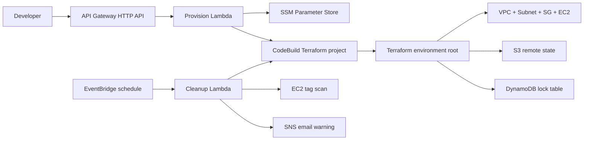

# aws-env-provisioner

API-driven, self-service AWS environment provisioning with automatic TTL cleanup.

Developers call an API Gateway endpoint with an environment name and TTL. API Gateway invokes a Python 3.12 Lambda that validates the request, stores request metadata in SSM Parameter Store, and starts an AWS CodeBuild project. CodeBuild runs Terraform to provision an isolated environment:

- VPC
- Public subnet
- Internet gateway and route table
- EC2 `t2.micro`
- Security group
- SSM environment metadata
- S3 remote Terraform state
- DynamoDB state locking

Every provisioned environment is tagged with:

- `owner`
- `created-at`
- `ttl-hours`
- `allowed-ssh-cidr`
- `provisioner/project`
- `provisioner/environment`

A separate EventBridge-scheduled cleanup Lambda runs every 2 hours. It scans live EC2 instances by tag, sends an SNS email 30 minutes before teardown when the scan catches the warning window, and starts a CodeBuild `destroy` run for expired environments.

## Architecture



## Repository Layout

```text
buildspec.yml                     # CodeBuild provision/destroy commands

lambda/
  provision/handler.py             # API Gateway Lambda
  cleanup/handler.py               # scheduled TTL cleanup Lambda

terraform/
  backend/                         # one-time S3 + DynamoDB bootstrap
  infrastructure/                  # API Gateway, Lambdas, CodeBuild, SNS, EventBridge, IAM
  environment/                     # Terraform root executed by CodeBuild
  modules/environment/             # VPC/subnet/EC2/security group module
```

## Request API

Endpoint:

```http
POST /environments
```

Example:

```bash
curl -X POST "<PROVISION_URL>" \
  -H "content-type: application/json" \
  -d '{
    "environment_name": "jaith-test",
    "ttl_hours": 2,
    "owner": "jaith",
    "allowed_ssh_cidr": "203.0.113.10/32"
  }'
```

Required fields:

| Field | Description |
| --- | --- |
| `environment_name` | 3-40 chars, alphanumeric or hyphen, no leading/trailing hyphen |
| `ttl_hours` | One of `2`, `4`, `8`, `24` |

Optional fields:

| Field | Description |
| --- | --- |
| `owner` | Stored in tags. If omitted, Lambda uses the caller source IP. |
| `allowed_ssh_cidr` | Security group SSH CIDR. Defaults to `default_allowed_ssh_cidr`. |

Successful response:

```json
{
  "message": "Provision build started",
  "environment_name": "jaith-test",
  "build_id": "aws-env-provisioner-terraform:...",
  "build_arn": "arn:aws:codebuild:...",
  "created_at": "2026-05-18T10:15:00Z"
}
```

## Prerequisites

- AWS account with free tier eligibility.
- Terraform `>= 1.6`.
- AWS CLI configured locally for initial bootstrap.
- This repository pushed to GitHub, CodeCommit, or another CodeBuild-supported source.
- CodeBuild source access configured for your repo if it is private.

The Terraform in `terraform/infrastructure` creates the runtime IAM roles. You do not need `AdministratorAccess` for CodeBuild or either Lambda at runtime.

## 1. Bootstrap Terraform State

The backend stack creates:

- S3 bucket for remote state.
- DynamoDB table for state locks.

Pick a globally unique S3 bucket name:

```bash
cd terraform/backend

terraform init

terraform apply \
  -var="aws_region=us-east-1" \
  -var="state_bucket_name=<globally-unique-state-bucket>" \
  -var="lock_table_name=aws-env-provisioner-tf-locks"
```

Save the output values.

## 2. Deploy Main Infrastructure

This creates:

- API Gateway HTTP API.
- Provision Lambda.
- Cleanup Lambda.
- EventBridge schedule.
- SNS warning topic and optional email subscription.
- CodeBuild Terraform project.
- Runtime IAM roles and least-privilege inline policies.

```bash
cd terraform/infrastructure

terraform init \
  -backend-config="bucket=<STATE_BUCKET>" \
  -backend-config="key=infra/main/terraform.tfstate" \
  -backend-config="region=us-east-1" \
  -backend-config="dynamodb_table=<LOCK_TABLE>" \
  -backend-config="encrypt=true"

terraform apply \
  -var="aws_region=us-east-1" \
  -var="state_bucket_name=<STATE_BUCKET>" \
  -var="lock_table_name=<LOCK_TABLE>" \
  -var="repository_url=https://github.com/<OWNER>/aws-env-provisioner.git" \
  -var="source_version=main" \
  -var="sns_email=you@example.com"
```

Confirm the SNS email subscription. AWS will not deliver email notifications until you confirm it.

Get the API URL:

```bash
terraform output provision_url
```

## CodeBuild Source Access

The generated CodeBuild project uses:

```hcl
source {
  type      = "GITHUB"
  location  = var.repository_url
  buildspec = "buildspec.yml"
}
```

For a public GitHub repository, CodeBuild can usually clone directly. For a private repository, configure CodeBuild source credentials or a CodeStar connection in AWS, then adjust the `source` block if your organization requires `CODECONNECTIONS`.

## Runtime IAM Roles

Terraform creates these roles:

| Role | Purpose |
| --- | --- |
| `aws-env-provisioner-terraform-role` | CodeBuild service role that runs Terraform provision/destroy. |
| `aws-env-provisioner-provision-api-role` | Provision Lambda role that writes SSM metadata and starts provision builds. |
| `aws-env-provisioner-cleanup-role` | Cleanup Lambda role that scans tags, sends SNS warnings, and starts destroy builds. |

The policies below are the runtime policies the Terraform applies, with placeholders expanded by Terraform.

### CodeBuild Role Policy

CodeBuild needs state access, lock access, logs, SSM metadata access, and the specific EC2 APIs Terraform uses for the environment.

```json
{
  "Version": "2012-10-17",
  "Statement": [
    {
      "Sid": "WriteBuildLogs",
      "Effect": "Allow",
      "Action": [
        "logs:CreateLogStream",
        "logs:PutLogEvents"
      ],
      "Resource": "arn:aws:logs:<AWS_REGION>:<ACCOUNT_ID>:log-group:/aws/codebuild/aws-env-provisioner-terraform:*"
    },
    {
      "Sid": "ListTerraformStatePrefix",
      "Effect": "Allow",
      "Action": "s3:ListBucket",
      "Resource": "arn:aws:s3:::<STATE_BUCKET>",
      "Condition": {
        "StringLike": {
          "s3:prefix": [
            "envs/*"
          ]
        }
      }
    },
    {
      "Sid": "ManageTerraformStateObjects",
      "Effect": "Allow",
      "Action": [
        "s3:GetObject",
        "s3:PutObject",
        "s3:DeleteObject"
      ],
      "Resource": "arn:aws:s3:::<STATE_BUCKET>/envs/*"
    },
    {
      "Sid": "ManageTerraformLocks",
      "Effect": "Allow",
      "Action": [
        "dynamodb:DescribeTable",
        "dynamodb:GetItem",
        "dynamodb:PutItem",
        "dynamodb:DeleteItem",
        "dynamodb:UpdateItem"
      ],
      "Resource": "arn:aws:dynamodb:<AWS_REGION>:<ACCOUNT_ID>:table/<LOCK_TABLE>"
    },
    {
      "Sid": "ReadEc2ForTerraform",
      "Effect": "Allow",
      "Action": [
        "ec2:DescribeAccountAttributes",
        "ec2:DescribeAvailabilityZones",
        "ec2:DescribeImages",
        "ec2:DescribeInstances",
        "ec2:DescribeInternetGateways",
        "ec2:DescribeKeyPairs",
        "ec2:DescribeNetworkInterfaces",
        "ec2:DescribeRouteTables",
        "ec2:DescribeSecurityGroups",
        "ec2:DescribeSubnets",
        "ec2:DescribeTags",
        "ec2:DescribeVpcs"
      ],
      "Resource": "*"
    },
    {
      "Sid": "ManageProvisionedEc2Environment",
      "Effect": "Allow",
      "Action": [
        "ec2:AssociateRouteTable",
        "ec2:AttachInternetGateway",
        "ec2:AuthorizeSecurityGroupEgress",
        "ec2:AuthorizeSecurityGroupIngress",
        "ec2:CreateInternetGateway",
        "ec2:CreateRoute",
        "ec2:CreateRouteTable",
        "ec2:CreateSecurityGroup",
        "ec2:CreateSubnet",
        "ec2:CreateTags",
        "ec2:CreateVpc",
        "ec2:DeleteInternetGateway",
        "ec2:DeleteRoute",
        "ec2:DeleteRouteTable",
        "ec2:DeleteSecurityGroup",
        "ec2:DeleteSubnet",
        "ec2:DeleteTags",
        "ec2:DeleteVpc",
        "ec2:DetachInternetGateway",
        "ec2:DisassociateRouteTable",
        "ec2:ModifySubnetAttribute",
        "ec2:ModifyVpcAttribute",
        "ec2:RevokeSecurityGroupEgress",
        "ec2:RevokeSecurityGroupIngress",
        "ec2:RunInstances",
        "ec2:TerminateInstances"
      ],
      "Resource": "*"
    },
    {
      "Sid": "ManageEnvironmentParameters",
      "Effect": "Allow",
      "Action": [
        "ssm:GetParameter",
        "ssm:PutParameter",
        "ssm:DeleteParameter"
      ],
      "Resource": [
        "arn:aws:ssm:<AWS_REGION>:<ACCOUNT_ID>:parameter/aws-env-provisioner/environments/*",
        "arn:aws:ssm:<AWS_REGION>:<ACCOUNT_ID>:parameter/aws-env-provisioner/warnings/*",
        "arn:aws:ssm:<AWS_REGION>:<ACCOUNT_ID>:parameter/aws-env-provisioner/teardown-requests/*"
      ]
    }
  ]
}
```

EC2 create/delete workflows have uneven resource-level permission support, so the EC2 section uses an explicit action allow-list. The Terraform module tags every created resource, and cleanup only targets resources with `provisioner/project=aws-env-provisioner`.

### Provision Lambda Role Policy

```json
{
  "Version": "2012-10-17",
  "Statement": [
    {
      "Sid": "WriteLogs",
      "Effect": "Allow",
      "Action": [
        "logs:CreateLogStream",
        "logs:PutLogEvents"
      ],
      "Resource": "arn:aws:logs:<AWS_REGION>:<ACCOUNT_ID>:log-group:/aws/lambda/aws-env-provisioner-provision-api:*"
    },
    {
      "Sid": "StartProvisionBuild",
      "Effect": "Allow",
      "Action": "codebuild:StartBuild",
      "Resource": "arn:aws:codebuild:<AWS_REGION>:<ACCOUNT_ID>:project/aws-env-provisioner-terraform"
    },
    {
      "Sid": "WriteEnvironmentMetadata",
      "Effect": "Allow",
      "Action": [
        "ssm:GetParameter",
        "ssm:PutParameter"
      ],
      "Resource": "arn:aws:ssm:<AWS_REGION>:<ACCOUNT_ID>:parameter/aws-env-provisioner/environments/*"
    }
  ]
}
```

### Cleanup Lambda Role Policy

```json
{
  "Version": "2012-10-17",
  "Statement": [
    {
      "Sid": "WriteLogs",
      "Effect": "Allow",
      "Action": [
        "logs:CreateLogStream",
        "logs:PutLogEvents"
      ],
      "Resource": "arn:aws:logs:<AWS_REGION>:<ACCOUNT_ID>:log-group:/aws/lambda/aws-env-provisioner-cleanup:*"
    },
    {
      "Sid": "ReadTaggedEc2Resources",
      "Effect": "Allow",
      "Action": [
        "ec2:DescribeInstances",
        "ec2:DescribeTags"
      ],
      "Resource": "*"
    },
    {
      "Sid": "StartDestroyBuild",
      "Effect": "Allow",
      "Action": "codebuild:StartBuild",
      "Resource": "arn:aws:codebuild:<AWS_REGION>:<ACCOUNT_ID>:project/aws-env-provisioner-terraform"
    },
    {
      "Sid": "PublishWarnings",
      "Effect": "Allow",
      "Action": "sns:Publish",
      "Resource": "arn:aws:sns:<AWS_REGION>:<ACCOUNT_ID>:aws-env-provisioner-teardown-warnings"
    },
    {
      "Sid": "TrackWarningsAndTeardowns",
      "Effect": "Allow",
      "Action": [
        "ssm:GetParameter",
        "ssm:PutParameter"
      ],
      "Resource": [
        "arn:aws:ssm:<AWS_REGION>:<ACCOUNT_ID>:parameter/aws-env-provisioner/warnings/*",
        "arn:aws:ssm:<AWS_REGION>:<ACCOUNT_ID>:parameter/aws-env-provisioner/teardown-requests/*"
      ]
    }
  ]
}
```

## Provision Flow Details

`lambda/provision/handler.py`:

1. Accepts JSON body or query parameters.
2. Validates:
   - environment name format
   - TTL is one of `2`, `4`, `8`, `24`
   - SSH CIDR is valid
3. Stores request metadata in:

   ```text
   /aws-env-provisioner/environments/<environment-name>
   ```

4. Starts CodeBuild with environment overrides:

   ```text
   ACTION=provision
   ENVIRONMENT_NAME=<name>
   TTL_HOURS=<2|4|8|24>
   OWNER=<owner>
   CREATED_AT=<UTC timestamp>
   ALLOWED_SSH_CIDR=<cidr>
   ```

`buildspec.yml` initializes the backend key:

```text
envs/<environment-name>/terraform.tfstate
```

and runs:

```bash
terraform apply -auto-approve
```

## Destroy Flow Details

`lambda/cleanup/handler.py`:

1. Runs every 2 hours through EventBridge.
2. Scans EC2 instances with:

   ```text
   provisioner/project=aws-env-provisioner
   ```

3. Reads `created-at` and `ttl-hours`.
4. Sends one SNS warning per environment when inside the warning window.
5. Starts CodeBuild with:

   ```text
   ACTION=destroy
   ENVIRONMENT_NAME=<name>
   TTL_HOURS=<original ttl>
   OWNER=<original owner>
   CREATED_AT=<original timestamp>
   ALLOWED_SSH_CIDR=<original cidr>
   ```

6. `buildspec.yml` runs:

   ```bash
   terraform destroy -auto-approve
   ```

7. On successful destroy, CodeBuild deletes warning and teardown marker parameters.

## Manual Destroy

Start a destroy build directly:

```bash
aws codebuild start-build \
  --project-name aws-env-provisioner-terraform \
  --environment-variables-override \
    name=ACTION,value=destroy,type=PLAINTEXT \
    name=ENVIRONMENT_NAME,value=jaith-test,type=PLAINTEXT \
    name=TTL_HOURS,value=2,type=PLAINTEXT \
    name=OWNER,value=jaith,type=PLAINTEXT \
    name=CREATED_AT,value=2026-05-18T10:15:00Z,type=PLAINTEXT \
    name=ALLOWED_SSH_CIDR,value=127.0.0.1/32,type=PLAINTEXT
```

Use the original tag values where possible. Terraform destroy mainly needs the same `ENVIRONMENT_NAME` so it can initialize the correct state key.

## Verification

Provision:

```bash
curl -X POST "<PROVISION_URL>" \
  -H "content-type: application/json" \
  -d '{"environment_name":"jaith-test","ttl_hours":2,"owner":"jaith","allowed_ssh_cidr":"203.0.113.10/32"}'
```

Watch CodeBuild:

```bash
aws codebuild list-builds-for-project \
  --project-name aws-env-provisioner-terraform
```

Check live environments:

```bash
aws ec2 describe-instances \
  --filters "Name=tag:provisioner/project,Values=aws-env-provisioner" \
  --query "Reservations[].Instances[].{Id:InstanceId,State:State.Name,Env:Tags[?Key=='provisioner/environment']|[0].Value,Owner:Tags[?Key=='owner']|[0].Value,Created:Tags[?Key=='created-at']|[0].Value,TTL:Tags[?Key=='ttl-hours']|[0].Value}" \
  --output table
```

Check SSM metadata:

```bash
aws ssm get-parameter \
  --name "/aws-env-provisioner/environments/jaith-test" \
  --query "Parameter.Value" \
  --output text
```

Invoke cleanup manually:

```bash
aws lambda invoke \
  --function-name aws-env-provisioner-cleanup \
  --payload '{}' \
  response.json

cat response.json
```

To force an expiration test, temporarily edit the EC2 `created-at` tag to more than the TTL in the past, then invoke the cleanup Lambda. It should start a destroy build and write:

```text
/aws-env-provisioner/teardown-requests/<environment-name>
```

## Free Tier Notes

This project is intentionally small:

- EC2 `t2.micro`.
- One VPC and one public subnet per environment.
- CodeBuild `BUILD_GENERAL1_SMALL`.
- Lambda 128 MB.
- EventBridge scheduled every 2 hours.
- S3 and DynamoDB with tiny state/lock usage.
- SNS email.
- SSM standard parameters.

Free tier depends on account age, region, and existing usage. Check AWS Billing after testing.

## Important Timing Detail

The cleanup Lambda runs every 2 hours. The SNS warning is sent when a scan observes an environment inside the 30-minute warning window. If an environment enters and leaves that window between scans, the next scan may find it already expired and start destroy immediately.

For more precise warnings, reduce the schedule:

```hcl
schedule_expression = "rate(15 minutes)"
```

## What Can Be Added Next

- IAM authorization or JWT authorizer on API Gateway.
- API keys and usage plans.
- SSM Session Manager access instead of public SSH.
- Per-owner email routing through SSM.
- Slack or Teams teardown notifications.
- A manual extension endpoint that updates `ttl-hours`.
- A manual destroy API endpoint.
- Cost guardrails with AWS Budgets.
- More Terraform environment modules, such as RDS, ECS, or ALB.
- CodeBuild report exports for Terraform plans.
- A small dashboard that reads SSM and tags to show active environments.

## Local Checks

Format Terraform:

```bash
terraform fmt -recursive terraform
```

Validate roots after providers are available:

```bash
terraform -chdir=terraform/environment init -backend=false
terraform -chdir=terraform/environment validate

terraform -chdir=terraform/infrastructure init -backend=false
terraform -chdir=terraform/infrastructure validate
```

Compile Lambda handlers:

```bash
python -m py_compile lambda/provision/handler.py lambda/cleanup/handler.py
```

